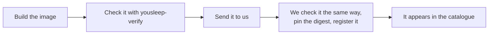

# Registration

An analysis enters the catalogue by registration. Registration is currently done
together with the platform team; a self-service path is being designed. This page
describes what to send, what we do with it, and what changes afterwards.

## What to send

A project started with [`yousleep-init`](../components/common/init.md) has everything
below in place after `make record`.

- **The image**, as a reference we can pull or as a `docker save` archive.
- **The configuration file**, the one `yousleep-verify` passed with.
- **The expected document**, `conformance/expected-events.json.gz`, recorded with
  `--record` on your final image.
- **The check's report**, `yousleep-verify --json`, so that we can compare it with
  our run.

Send it through the portal's contact form under *Integrate an algorithm*, or to
[contact@yousleep.ai](mailto:contact@yousleep.ai). Do not include real recordings:
the check runs on a synthetic one on both sides.

## What we do

1. Run the same check on the platform's architecture (`linux/amd64`). An image that
   fails there is not registered.
2. Pin the digest the check reports, so the exact bytes that passed are what runs.
3. Copy the image into a registry the platform controls. A past analysis has to stay
   re-runnable, and that cannot depend on a registry we do not operate.
4. Set the fields that are ours: scheduling, availability, and the memory terms that
   scale with recording length, which we measure on long recordings.
5. Register the configuration. Its provenance and licence blocks are shown to users as
   written, so they are checked for completeness, not rewritten.

## After registration

Your analysis is listed in the catalogue with its provenance, what it cites and the
licence it is offered under, and every result it produces carries that attribution. Who
may run it, and on what terms, follows from the licence class in the configuration.

## What changes later

The check you run and the check we run are the same tool. What is being designed
is the path between them: submitting the bundle above from the portal, a quarantine
where an image waits until the check has passed, and registration without a person
in the loop. When that exists, this page will describe a single command.
