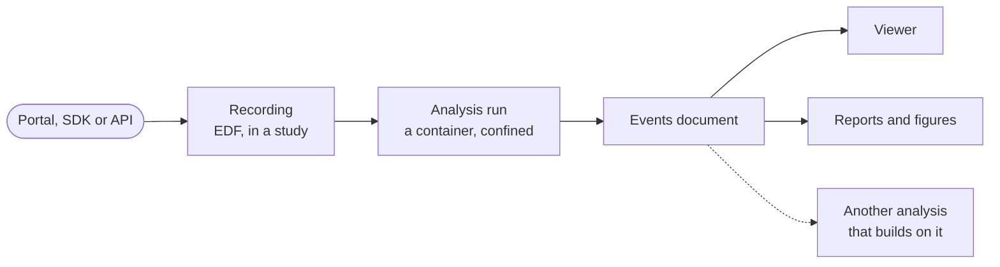

# youSleep for developers

The youSleep Portal runs peer-reviewed sleep-analysis algorithms on polysomnography
recordings, one at a time or across a cohort, and turns their output into events,
figures and reports. It can be used through the web portal, through the REST API and
its Python SDK, or by registering an analysis of your own to run on it.

!!! note "Research use"
    youSleep is for research and other non-commercial use. Neither the platform nor
    the analyses it hosts are medical devices, and their output is not a diagnosis.

-   :material-language-python:{ .lg .middle } **Automate with the SDK**

    ---

    Upload recordings, submit analyses and collect results from Python, for one file
    or a whole cohort, with typed models throughout.

    [:octicons-arrow-right-24: Python SDK](components/common/index.md)

-   :material-api:{ .lg .middle } **Call the REST API**

    ---

    Every SDK call is an HTTP request. The interactive reference documents each
    endpoint with its request and response schemas.

    [:octicons-arrow-right-24: API reference](https://api.yousleep.ai/docs)

-   :material-package-variant-closed:{ .lg .middle } **Build an analysis**

    ---

    Package an algorithm as a container that reads one manifest and writes one
    document, check it with the conformance tool, and register it.

    [:octicons-arrow-right-24: Packaging an analysis](components/common/analysis-authoring.md)

-   :material-map-outline:{ .lg .middle } **Understand the platform**

    ---

    Learn what projects, studies, recordings, analyses, events and reports are, and
    how a run moves through them.

    [:octicons-arrow-right-24: The platform in five minutes](start/platform.md)

## How a run moves through the platform

A recording is uploaded into a study. An analysis runs on it as a container. The
platform starts the container with one argument, the path of a manifest describing the
run, and collects one events document from it. The viewer overlays those events on the
signal, the reports summarise them, and a dependent analysis can take them as input.

## Where things are

| | |
|---|---|
| The portal | [portal.yousleep.ai](https://portal.yousleep.ai) |
| The REST API and its interactive reference | [api.yousleep.ai/docs](https://api.yousleep.ai/docs) |
| The Python SDK | [`yousleep-common` on PyPI](https://pypi.org/project/yousleep-common/) |
| Example analyses to copy from | [yousleep-ai/analysis-example](https://github.com/yousleep-ai/analysis-example) |
| Contact | [contact@yousleep.ai](mailto:contact@yousleep.ai), or the contact form in the portal |
