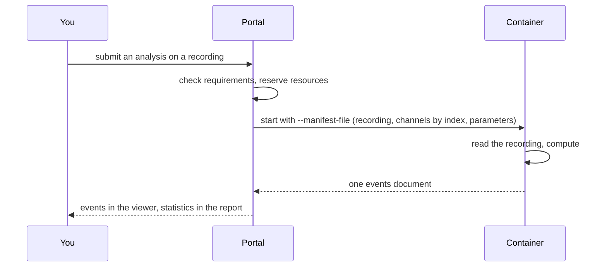

# The platform in five minutes

The platform is organised around six objects.

| Term | What it is |
|---|---|
| **Project** | The unit you organise and share, typically one per cohort or team. |
| **Study** | One subject's night (or longer recording), with its metadata: age, sex, lights off and on. |
| **Recording** | The EDF file of a study, with its channels as the file names them and as you name them. |
| **Analysis** | One run of one algorithm on one recording, with the parameters you chose. |
| **Events** | The output of an analysis: labelled intervals on the recording, such as sleep stages. |
| **Report** | Statistics and figures over a study, or over a project with its studies grouped and compared. |

## Ways of using the platform

-   :material-monitor:{ .lg .middle } **Use the portal**

    ---

    Create a project, upload recordings, run analyses, inspect signals with events
    overlaid, and read the reports.

-   :material-code-braces:{ .lg .middle } **Use the API and SDK**

    ---

    Run the same operations as HTTP requests, or through a typed Python client that
    adds end-to-end workflows. Suited to pipelines, integrations and large cohorts.

-   :material-package-variant:{ .lg .middle } **Bring your own analysis**

    ---

    Start a project with `yousleep-init`, replace the method, and register the
    image to run on the platform.

## What an analysis is

An analysis in the catalogue consists of two parts: a **container image**, and a
**configuration** that states what it is, who wrote it, what it needs from a recording
and what it produces. The platform reads the configuration to offer the analysis, to
check a recording against its requirements, to reserve the resources a run needs and to
present the result. The image receives only the manifest.

The container runs confined: no network, a read-only filesystem, an unprivileged user,
the cores and memory the configuration declares, and a time bound. Everything it needs
arrives as a file; everything it produces is a file.

## What is hosted today

**U-Sleep**, a published and peer-reviewed sleep-staging algorithm, in the
configurations listed in the [portal's analysis catalogue](https://portal.yousleep.ai/analyses).
Each configuration states who developed it, what it cites and under which licence it is
offered, and the catalogue shows that beside every result.

## What to read next

- To use the platform from code, read the [SDK overview](../components/common/index.md)
  and then the [SDK guide](../components/common/sdk-guide.md).
- To connect a system that submits on behalf of many subjects, read the
  [integration guide](../components/common/integration-guide.md).
- To bring your own algorithm, read [packaging an analysis](../components/common/analysis-authoring.md).
- The [glossary](glossary.md) defines the terms used on this page.
